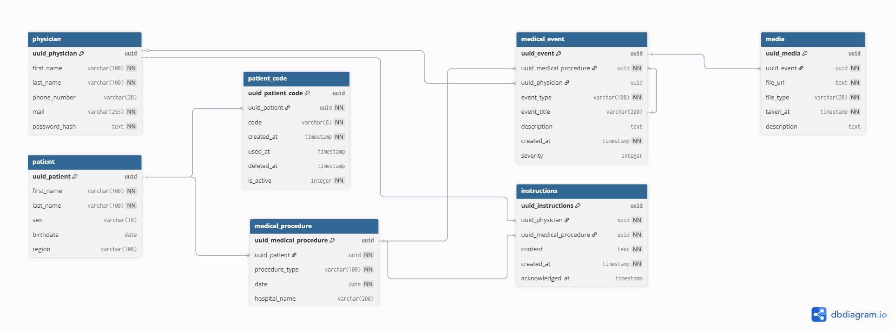

[← README](../README.md) · [Onboarding](onboarding.md) · [Lexique](lexique.md) · [CDC](cdc.md)

# Architecture — Sauver la Face

> Décisions techniques, choix d'architecture et pourquoi ils ont été faits.

---

## Vue d'ensemble

```text
┌─────────────────┐              ┌──────────────────┐              ┌────────────────┐
│  App mobile     │              │     Caddy        │              │  Dashboard web │
│  React Native   │◀──HTTPS─────▶│  Reverse Proxy   │◀──HTTPS─────▶│  Next.js 14    │
│  Expo SDK 52    │              │  TLS 1.3         │              │  Port 3000     │
│  (Android)      │              └────────▲─────────┘              └────────────────┘
└─────────────────┘                       │ HTTP (réseau interne Docker)
                                 ┌────────▼─────────┐
                                 │   Backend API    │
                                 │   Bun + Hono     │
                                 │   Port 3001      │
                                 └──────▲───────▲───┘
                                        │       │
                                  Drizzle ORM  Client S3
                                        │       │
                             ┌──────────▼─┐  ┌──▼──────────────────────────────────┐
                             │ PostgreSQL │  │            Client S3                │
                             │ (données)  │  │  dev : MinIO    prod : OVH S3 (HDS) │
                             └────────────┘  │  bucket photos  bucket logs-audit   │
                                             └─────────────────────────────────────┘
```

---

## Décisions d'architecture

### Pourquoi offline-first sur le mobile
Les patients sont au Cambodge avec une connexion réseau très instable. L'application doit fonctionner sans internet. Toutes les données (questionnaires, photos) sont d'abord stockées en SQLite local, puis synchronisées quand la connexion revient via une queue de sync (`sync_queue`).

### Pourquoi server-wins pour les conflits
Dans un contexte médical, les données du serveur (validées par un médecin) ont priorité sur celles du mobile. Si un patient modifie une réponse offline et que le médecin a modifié la même donnée entre-temps, la version médicale l'emporte. Tout conflit est loggé avant écrasement.

### Pourquoi Bun au lieu de Node.js
- Exécution TypeScript native sans transpilation
- Gestion des dépendances intégrée (remplace npm/yarn)
- Plus rapide au démarrage et à l'exécution
- Compatible avec l'écosystème Node.js existant

### Pourquoi Hono au lieu d'Express
- Conçu pour les runtimes modernes (Bun, Deno, Workers)
- Typage TypeScript natif sur les routes
- Performances supérieures à Express pour les API REST

### Pourquoi Drizzle ORM au lieu de Prisma
- Requêtes SQL typées sans couche d'abstraction lourde
- Migrations en TypeScript, versionnées dans le dépôt
- Compatibilité native Bun (Prisma nécessite des workarounds)

### Pourquoi Better Auth au lieu d'une auth custom
La gestion de l'authentification (sessions, tokens, MFA, refresh) est complexe et critique pour la sécurité. Better Auth gère tout ça sans qu'on ait à le coder. On se concentre sur la logique métier.

### Pourquoi un compte bot pour les workflows GitHub Actions
Les workflows qui commitent automatiquement sur `dev` (mise à jour `features.md`) ont besoin d'un token d'écriture. Deux options évaluées :
- **PAT personnel** — simple mais lié à une personne. Si elle quitte le projet, les workflows cassent.
- **Compte bot dédié (`sauver-la-face-bot`)** — retenu. Token indépendant des personnes, révocable sans impact sur l'équipe. Pratique recommandée par GitHub pour les automatisations en équipe.

### Pourquoi Caddy comme reverse proxy
- TLS 1.3 obligatoire pour les données de santé (RGPD + certification HDS) — Caddy l'active par défaut sans configuration
- Certificats Let's Encrypt automatiques — renouvellement inclus, zéro intervention manuelle
- En dev : certificat auto-signé en une ligne (`tls internal`)
- Config minimaliste (3 lignes) vs Nginx (~30 lignes) ou Traefik (labels Docker complexes)
- Hono ne termine jamais le TLS directement — Caddy est la seule porte d'entrée exposée à Internet

### Pourquoi OpenAPI avec @hono/zod-openapi
- Les schémas Zod de `@sauver-la-face/shared` sont réutilisés directement — aucune documentation manuelle
- `/docs` génère une interface Swagger UI interactive en dev
- `/openapi.json` permet de générer un client TypeScript pour le web et le mobile en une commande — les types sont toujours synchronisés avec le backend

### Pourquoi MinIO au lieu de S3 directement
- Déployable en local pour le développement (pas besoin de credentials AWS)
- Compatible avec l'API S3 — migration vers S3 ou OVH Object Storage sans changer le code
- Hébergeable sur OVH Cloud HDS (certification requise pour données médicales)

### Pourquoi polling au lieu de WebSockets pour les alertes
- 200 patients actifs max, 20 médecins max — le volume ne justifie pas la complexité des WebSockets
- TanStack Query gère le polling avec `refetchInterval` en une ligne
- Moins de surface d'attaque pour la sécurité
- Plus simple à débugger et maintenir
- Optimisation HTTP 304 : le backend calcule un ETag (hash MD5 des alertes actives) — si rien n'a changé, répond `304 Not Modified` sans body, TanStack Query conserve son cache automatiquement

### Pourquoi Pino au lieu de Winston ou console.log
- Le plus rapide des loggers Node.js (format JSON natif, pas de sérialisation coûteuse)
- Format JSON adapté aux outils de monitoring (Datadog, Loki, etc.)
- Niveaux structurés — permet de filtrer par `LOG_LEVEL` sans toucher au code

### Logs d'audit — stockage S3
Les logs d'audit (accès aux données médicales) sont une obligation HDS. Pino écrit dans un fichier local, un cron journalier exporte vers S3 :
- **Dev** : bucket `logs-audit` sur MinIO local
- **Prod** : bucket `logs-audit` sur OVH Object Storage (certifié HDS, rétention 1 an)

Même client S3 dans le code — seules les variables d'environnement changent entre dev et prod.

---

## Architecture backend — Feature-based + Clean Architecture + DDD

Chaque feature suit les 4 couches Clean Architecture. Les dépendances ne vont que vers l'intérieur : `presentation → application → domain ← infrastructure`.

**Convention de nommage : `camelCase` pour tous les fichiers sans exception.**

```text
features/auth/
  presentation/
    authRouter.ts              ← reçoit HTTP, valide avec Zod, appelle application
  application/
    authUsecase.ts             ← orchestration : appelle domain + repo, aucune règle métier
  domain/
    physician.ts               ← Entity DDD (UUID, identité persistante, règles métier)
    physicianRepository.ts     ← interface (port) — aucune dépendance externe
    patientCode.ts             ← Entity DDD
    patientCodeRepository.ts   ← interface (port) — aucune dépendance externe
    patientCodeValue.ts        ← Value Object DDD (pas d'UUID, immuable, create() valide)
  infrastructure/
    physicianRepository.ts     ← implémentation Drizzle (adapter)
    patientCodeRepository.ts   ← implémentation Drizzle (adapter)
```

**Couche `application/` :**
- Chef d'orchestre : reçoit une commande, appelle le domaine, appelle l'infra via les interfaces
- Délègue toute règle métier aux Entities et Value Objects de `domain/`
- N'appelle jamais l'implémentation Drizzle directement — uniquement les interfaces

**Couche `domain/` — DDD :**
- **Entity** : a un UUID, identité persistante même si les attributs changent
- **Value Object** : pas d'UUID, défini par sa valeur, immuable, constructeur privé + `create()` qui valide
- Les règles métier et validations vivent ici — jamais dans `application/`

**Répartition domain/ vs packages/shared :**
- Concept utilisé par une seule app → `domain/` de la feature
- Concept utilisé par plusieurs apps → `packages/shared/src/domain/`

**Règles absolues :**
- `domain/` ne connaît ni Drizzle, ni Hono, ni rien d'externe
- `presentation/` ne contient aucune logique métier — valide et délègue uniquement
- `infrastructure/` ne contient aucune logique métier — lit/écrit uniquement
- Même fichier `camelCase` dans `domain/` (interface) et `infrastructure/` (implémentation) — le dossier distingue les deux

---

## Architecture web — Feature-based (Next.js App Router)

Pages fines dans `app/`, toute la logique dans `features/`.

```text
apps/web/src/
  app/                        ← routing Next.js (pages fines — importent depuis features/)
  features/
    [feature]/
      components/             ← UI pure (JSX uniquement, aucun appel API direct)
      hooks/                  ← logique métier + appels API via TanStack Query
      actions/                ← Server Actions Next.js (mutations : créer, modifier, supprimer)
```

**Règles absolues :**
- `components/` reçoit des props et consomme des hooks — jamais de `fetch` direct
- `hooks/` contient toute la logique — `usePatients()`, `useAlerts()`, etc.
- `actions/` pour les mutations côté serveur

---

## Architecture mobile — offline-first par feature

```text
feature/
  [feature]Screen.tsx    ← composant UI
  [feature]Storage.ts    ← lecture/écriture SQLite local
  [feature]Service.ts    ← orchestration : storage → sync_queue → API
```

**Règle absolue** : toute donnée est d'abord écrite en SQLite (`feature.storage.ts`) avant tout appel réseau. L'appel réseau est géré par la queue de sync, pas directement dans l'UI.

---

## Schéma de base de données



Toutes les migrations sont **additives** : on n'ajoute que des colonnes nullable, jamais de suppression ni de renommage. Raison : les appareils mobiles peuvent être désynchronisés depuis plusieurs semaines — un schéma incompatible bloquerait leur synchronisation.

---

## Sécurité

| Couche | Mécanisme |
|---|---|
| Transit | TLS 1.3 obligatoire (RGPD + HDS) — terminé par Caddy |
| Stockage mobile | AES-256-GCM via expo-secure-store |
| Auth médecins | MFA TOTP obligatoire (Better Auth) |
| Auth patients | Code 6 chiffres + JWT signé HMAC-SHA256 |
| Intégrité photos | Checksum SHA-256 calculé mobile, vérifié backend |
| Consentement | Écran RGPD obligatoire au premier lancement (date sauvegardée) |
| Hébergement | OVH Cloud certifié HDS |
| CSRF | Cookies `SameSite=Strict` sur le dashboard web (géré par Better Auth) |
| Audit logs | Chaque accès aux données médicales loggé — rétention 1 an (HDS) — voir AUDIT-01 |

### JWT — durée de vie et renouvellement

| Profil | Expiration | Renouvellement |
|---|---|---|
| Médecin (web) | 2h d'inactivité | Silencieux automatique tant qu'actif — déconnexion si inactif 2h |
| Patient (mobile) | 1 an | Renouvelé automatiquement à chaque connexion — révocation explicite possible par le médecin |

### Rate limiting — protection force brute

| Endpoint | Seuil | Blocage |
|---|---|---|
| Code 6 chiffres (patient) | 3 tentatives échouées | 15 minutes par IP |
| Login médecin | 3 tentatives échouées | 15 minutes par IP |

Les deux mécanismes sont indépendants : le blocage 15 min protège contre la force brute, l'expiration 48h gère le cycle de vie du code patient.

### Rotation des secrets (production uniquement)

| Secret | Fréquence |
|---|---|
| Clés JWT | Tous les 90 jours |
| Credentials OVH Object Storage (S3) | Tous les 90 jours |

> Dev : pas de rotation obligatoire — credentials dans `.env.local` uniquement.

> Détails d'implémentation : voir `docs/cdc.md`

---

## Contraintes de volume

Ces contraintes ont guidé les choix d'architecture (polling vs WebSocket, SQLite vs autre, etc.) :

- 200 patients actifs simultanés max
- 20 utilisateurs web simultanés max
- APK Android < 30 Mo
- Cache SQLite mobile : 50 Mo max par appareil
- Photos : max 50 par patient, JPEG qualité 80%, < 2 Mo
